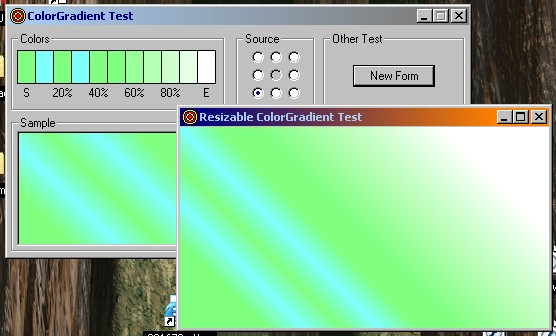

<div align="center">

## ColorGradient Class


</div>

### Description

This is an improvement upon my ColorFade class. Supply up to 11 colors (0% to 100% by 10%) and it will produce a gradient on your form or picture box. Optionally choose up to 8 sources for the gradient (4 sides, 4 corners). The only file needed is the class module. The test project is for demonstration purposes. Updated with comments. Added a new UnSetColor method.
 
### More Info
 
Include the class in your project and declare it. Specify up to 11 colors and a gradient source using the SetColor method with an index of 0 through 10. Use the PaintObject method to draw the gradient.

This code does not require ColorFade. It is standalone. Much of the code in this class was derived from ColorFade. If you need a midpoint color, use ColorFade instead of ColorGradient.

A gradient drawn on a form or picture box.

Make sure the auto-redraw is on. After you draw the gradient on an object, call the object's Refresh method.


<span>             |<span>
---                |---
**Submitted On**   |2004-05-20 11:02:10
**By**             |[Brian Zablocky](https://github.com/Planet-Source-Code/PSCIndex/blob/master/ByAuthor/brian-zablocky.md)
**Level**          |Advanced
**User Rating**    |4.8 (24 globes from 5 users)
**Compatibility**  |VB 6\.0
**Category**       |[Miscellaneous](https://github.com/Planet-Source-Code/PSCIndex/blob/master/ByCategory/miscellaneous__1-1.md)
**World**          |[Visual Basic](https://github.com/Planet-Source-Code/PSCIndex/blob/master/ByWorld/visual-basic.md)
**Archive File**   |[ColorGradi1748025202004\.zip](https://github.com/Planet-Source-Code/brian-zablocky-colorgradient-class__1-53797/archive/master.zip)

### API Declarations

```
'
' No API. Pure VB
'
```


